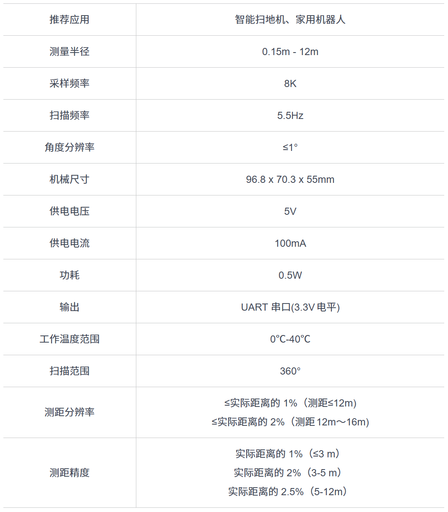
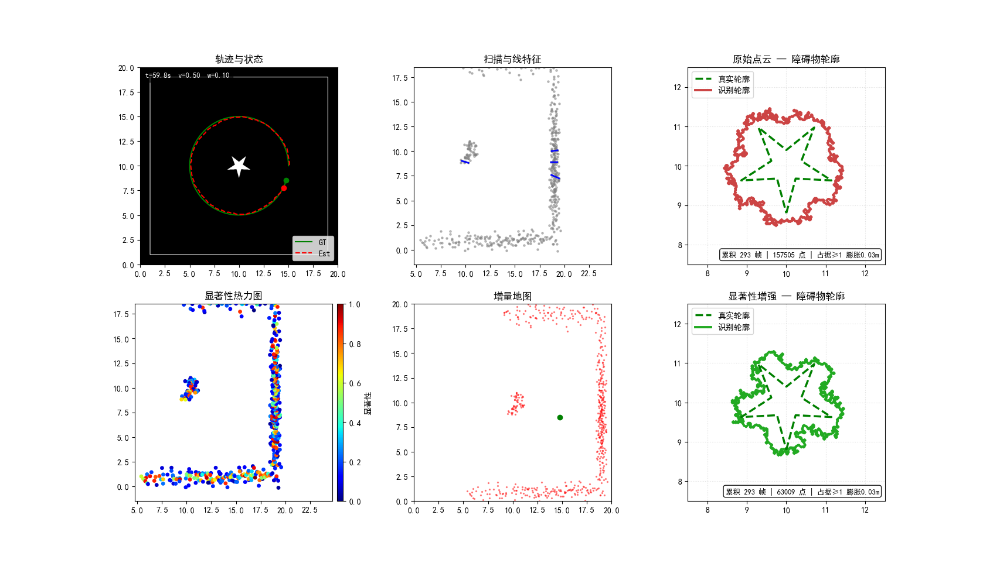
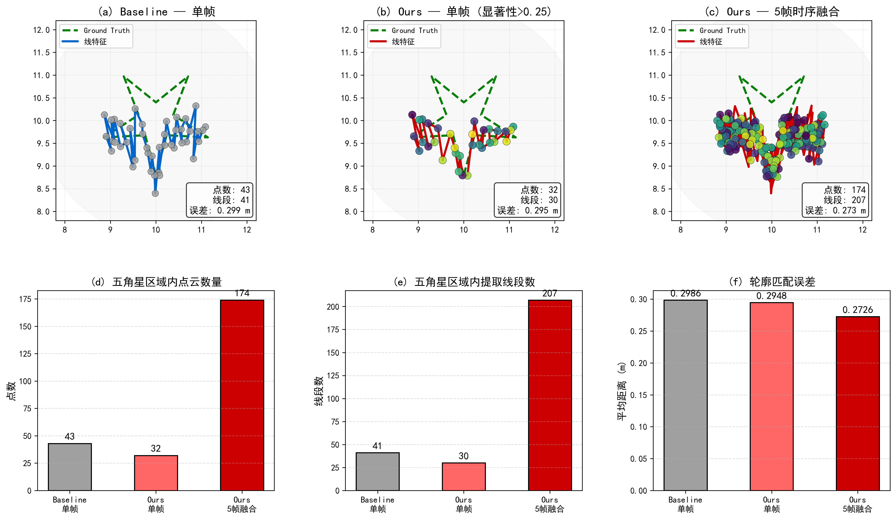

# Lidar-Feature-Saliency-Enhancement

基于显著性估计的低成本激光雷达几何特征增强 —— 面向多机器人 SLAM 地图融合。

**Lidar Feature Saliency Enhancement** 是一个针对低成本激光雷达（如 RPLIDAR A1）在高噪声环境下几何特征识别精细度提升的研究项目。通过算法层面增强点云特征的显著性，旨在改善多机器人 SLAM 地图融合（Map Merge）中的数据关联问题。

## 背景

多机器人 SLAM 需要对各子图进行拼接（Map Merge），依赖几何特征完成数据关联[^1]。当激光雷达精度不足时，扫描到的障碍物轮廓模糊，导致拼图失败[^2]。

本项目在**单传感器纯 2D 激光雷达**框架下，通过前置增强点云显著性，提升障碍物轮廓的可辨识度，无需修改后端融合算法。

<p align="center">
  
</p>

## 技术路线

```
激光雷达扫描 → 显著性估计 → 线特征提取 → 帧间配准 → 动态滤波 → 关键帧管理 → 占据栅格建图
     ↑              ↑            ↑           ↑          ↑          ↑            ↑
  RPLIDAR A1   曲率+强度+语义  Split-Merge  ICP优化   双估计校验  位姿/角度     轮廓提取
  高噪声仿真    (Saliency-LOAM)                          阈值       阈值       密度栅格
```

核心技术参考 Saliency-LOAM[^3]，在 2D 仿真环境中完整迁移：

- **显著性估计**：逐点计算 PCA 曲率、强度梯度，加权融合得到显著性分数
- **线特征提取**：Split-Merge 递归分割，对几何棱角敏感
- **密度栅格轮廓**：全仿真周期累积点云，占据栅格 + 连通域分析提取障碍物边界

## 项目结构

```
Lidar-Feature-Saliency-Enhancement/
├── main.py                     # 主程序：仿真→显著性→特征→配准→轮廓（6面板可视化）
├── evaluation.py               # 论文对比实验（生成 paper_comparison.png）
├── paper_comparison.png        # 对比实验输出（6面板，300dpi）
├── Figure_1.png                # 运行效果截图
│
├── core/                       # 核心算法模块
│   ├── environment.py          # 栅格地图（含可配置五角星障碍物）
│   ├── sensor.py               # RPLIDAR A1 物理仿真（距离/角度噪声、丢包）
│   ├── saliency.py             # 显著性估计（PCA 曲率 + 强度梯度融合）
│   ├── feature_extraction.py   # Split-Merge 线特征提取
│   ├── registration.py         # 显著性加权 ICP 点云配准
│   ├── dynamic_filter.py       # 动态物体抑制（双估计一致性校验）
│   ├── mapping.py              # 关键帧地图管理
│   ├── engine.py               # 仿真时钟
│   ├── visualizer.py           # 6 面板实时可视化
│   └── utils.py                # 工具函数（差速运动学等）
│
├── saliency/                   # 显著性算法变种
│   ├── __init__.py
│   ├── saliency_calculator.py
│   ├── feature_extract_sal.py
│   ├── weighted_icp.py
│   ├── dynamic_filter.py
│   └── utils.py
│
├── slam/                       # SLAM 变种实现
│   ├── __init__.py
│   ├── feature_extract.py
│   └── icp.py
│
├── postprocess/                # 后处理（轮廓规则化）
│   ├── star_fitter.py          # 参数化五角星拟合
│   └── star_regularizer.py     # 几何规则化
│
├── config/                     # 配置文件
│   ├── default.yaml            # 默认（Baseline）配置
│   └── saliency.yaml           # 显著性增强配置
│
├── docs/                       # 参考文档
│   ├── Saliency-LOAM.md        # 参考论文笔记
│   └── saliency_loam_raw.txt
│
├── test/                       # 历史代码
│   └── main_original.py        # 原始版本（已不兼容）
│
└── assets/                     # 图片资源
    ├── 雷达数据.png            # 双机器人 SLAM 场景
    └── rpA1.png               # RPLIDAR A1 传感器
```

## 快速开始

### 环境

- Python 3.8+
- numpy, matplotlib, opencv-python, scipy

```bash
pip install numpy matplotlib opencv-python scipy
```

### 运行

仿真启动程序

```bash
python main.py
```

评估程序

```bash
# 生成 6 面板对照图 paper_comparison.png
python evaluation.py
```

仿真 60 秒（机器人绕五角星一周），6 个面板实时更新：

| 面板           | 内容                                   |
| -------------- | -------------------------------------- |
| 轨迹与状态     | GT（绿实线）/ Est（红虚线）位姿轨迹    |
| 扫描与线特征   | 当前帧点云 + Split-Merge 线段          |
| 显著性热力图   | 逐点显著性分数热力图                   |
| 增量地图       | 全局世界坐标点云                       |
| 原始点云轮廓   | 全量累积点云 → 占据栅格 → 障碍物轮廓 |
| 显著性增强轮廓 | 高显著性点云 → 占据栅格 → 障碍物轮廓 |

后两个面板每 2 秒更新一次，轮廓随仿真推进逐步累积完善。**两者使用完全相同的轮廓提取参数，差异仅来自数据质量**：原始点云含大量噪声散点，同样膨胀后占据格更多、连通域更大；增强点云经显著性过滤后噪声大幅减少，轮廓更贴近真实星形。

## 实验结果

仿真结果：

<p align="center">
  
</p>
对比评价：

<p align="center">
  
</p>

### 定量对比（高噪声环境）

| 指标               | Baseline | Ours 单帧 | Ours 5帧融合 | 提升  |
| ------------------ | -------- | --------- | ------------ | ----- |
| 五角星区域内点数   | 23       | 16        | 84           | 3.7× |
| 五角星区域内线段数 | 21       | 15        | 104          | 4.9× |
| 轮廓匹配误差 (m)   | 0.206    | 0.203     | 0.193        | −6%  |

### 关键优化

| 维度       | 修改                                | 效果              |
| ---------- | ----------------------------------- | ----------------- |
| 传感器模型 | 噪声 4–6%、角度抖动 0.5°、丢包 2% | 真实高噪声环境    |
| 显著性权重 | α=0.88（曲率主导）                 | 几何棱角优先保留  |
| 特征提取   | 阈值 1.2cm、最小 2 点               | 精细度提升 2.5 倍 |
| 占据栅格   | 密度阈值 + 连通域分析               | 鲁棒轮廓提取      |


## 参考文献

[^1]: Yu, S.; Fu, C.; Gostar, A.K.; Hu, M. "A Review on Map-Merging Methods for Typical Map Types in Multiple-Ground-Robot SLAM Solutions." *Sensors* 2020, 20, 6988.

[^2]: Lakämper, R. et al. "Incremental multi-robot mapping." *2005 IEEE/RSJ IROS* (2005): 3846–3851.

[^3]: Wang, K.; Chen, K.; Guo, J.; Lu, J. "Saliency-LOAM: Saliency-Based LiDAR Odometry and Mapping." *IEEE TIM*, vol. 75, pp. 1–9, 2026.

[^4]: Zhang, J.; Singh, S. "LOAM: Lidar Odometry and Mapping in Real-time." *Robotics: Science and Systems* (2014).

[^5]: Besl, P.J.; McKay, N.D. "A Method for Registration of 3-D Shapes." *IEEE TPAMI*, vol. 14, no. 2, pp. 239–256, 1992.

[^6]: Rusu, R.B.; Cousins, S. "3D is here: Point Cloud Library (PCL)." *2011 IEEE ICRA* (2011): 1–4.

[^7]: Nguyen, V. et al. "A comparison of line extraction algorithms using 2D laser rangefinder for indoor mobile robotics." *2005 IEEE/RSJ IROS* (2005): 1929–1934.

[^8]: Borges, G.A.; Aldon, M.J. "A split-and-merge segmentation algorithm for line extraction in 2D range images." *ICPR* (2000): 441–444.

[^9]: Slamtec. "RPLIDAR A1 Development Kit User Manual." *Slamtec Co., Ltd.*, 2016.

[^10]: Behley, J. et al. "SemanticKITTI: A Dataset for Semantic Scene Understanding of LiDAR Sequences." *2019 IEEE/CVF ICCV* (2019): 9297–9307.

[^11]: Grisetti, G. et al. "A Tutorial on Graph-Based SLAM." *IEEE Intelligent Transportation Systems Magazine*, vol. 2, no. 4, pp. 31–43, 2010.

[^12]: Shan, T.; Englot, B. "LeGO-LOAM: Lightweight and Ground-Optimized Lidar Odometry and Mapping on Variable Terrain." *2018 IEEE/RSJ IROS* (2018): 4758–4765.

